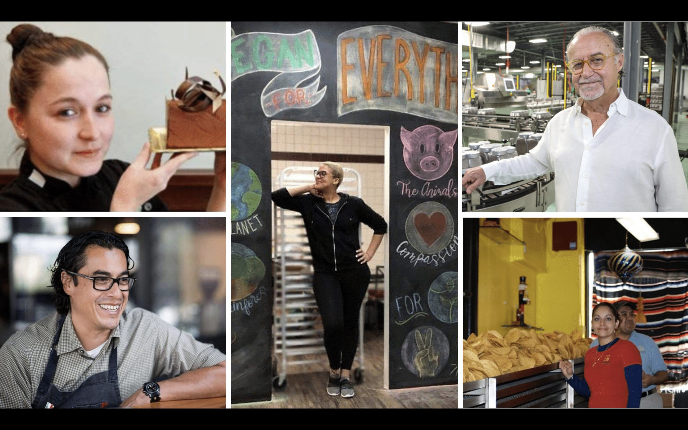

# 🖼️ FLEXCREDI - SOLUÇÃO PARA IMAGENS

**Como resolver o problema das 39 imagens (16.5 MB) na exportação**

---

## 🚨 O PROBLEMA

Imagens **NÃO podem ser transferidas via texto** entre chats de IA.

**Total de imagens:**
- 39 arquivos
- 16.5 MB
- Formatos: PNG (logos) e JPG (fotos)

---

## ✅ 4 SOLUÇÕES COMPLETAS

### **SOLUÇÃO A: Upload Manual** ⭐ MELHOR RESULTADO

#### **Processo:**
1. No ambiente atual (este chat), baixar as 39 imagens
2. No novo chat com GitHub, fazer upload de cada imagem
3. IA coloca cada imagem na pasta correta

#### **Vantagens:**
- ✅ 100% idêntico ao original
- ✅ Qualidade preservada
- ✅ Nomes de arquivo corretos
- ✅ Nenhuma alteração necessária nos HTMLs

#### **Desvantagens:**
- ⏱️ Mais demorado (upload de 39 arquivos)
- 💾 Requer download/upload manual

#### **Comandos para o Novo Chat:**
```
Após receber cada imagem do usuário:
1. Salvar em images/ com nome original
2. Verificar: LS images/
3. Confirmar tamanho do arquivo
```

---

### **SOLUÇÃO B: Placeholders SVG** ⭐ MAIS RÁPIDO

#### **Processo:**
1. IA cria placeholders SVG para cada imagem
2. Placeholders mostram nome do arquivo e dimensões
3. Usuário substitui depois com imagens reais

#### **Exemplo de Placeholder:**
```svg
<!-- images/flexcredi-official-logo.png -->
<svg width="200" height="100" xmlns="http://www.w3.org/2000/svg">
  <rect width="200" height="100" fill="#2ECC71"/>
  <text x="50%" y="50%" text-anchor="middle" fill="white">
    LOGO FLEXCREDI
  </text>
</svg>
```

#### **Vantagens:**
- ⚡ Muito rápido (IA cria automaticamente)
- 🎯 Site funciona imediatamente
- 📐 Mantém dimensões corretas
- 🔄 Fácil substituir depois

#### **Desvantagens:**
- 🎨 Visual temporário (não as imagens reais)
- 🔧 Requer substituição posterior

#### **Comandos para o Novo Chat:**
```
Para cada imagem listada:
1. Criar placeholder SVG com nome e dimensões
2. Salvar na pasta images/ com nome correto
3. Adicionar comentário: <!-- PLACEHOLDER - substituir com imagem real -->
```

#### **Lista de Placeholders Necessários:**

**Logos (3):**
- flexcredi-official-logo.png (200x100)
- flexcredi-logo-official.png (200x100)
- flexcredi-logo-transparent.png (200x100)

**Banners (6):**
- banner-restaurant-simple.jpg (800x400)
- banner-beauty-simple.jpg (800x400)
- banner-construction-simple.jpg (800x400)
- banner-foodtruck-simple.jpg (800x400)
- banner-auto-simple.jpg (800x400)
- banner-retail-simple.jpg (800x400)

**Carousel (6):**
- carousel-restaurant-success.jpg (1200x600)
- carousel-beauty-salon.jpg (1200x600)
- carousel-construction.jpg (1200x600)
- carousel-food-truck.jpg (1200x600)
- carousel-auto-repair.jpg (1200x600)
- carousel-retail-store.jpg (1200x600)

**Mosaicos (6):**
- mosaic-restaurant.jpg (1600x900)
- mosaic-beauty.jpg (1600x900)
- mosaic-construction.jpg (1600x900)
- mosaic-foodtruck.jpg (1600x900)
- mosaic-auto.jpg (1600x900)
- mosaic-retail.jpg (1600x900)

**Outras (18):**
- latino-entrepreneurs-florida.jpg (1200x800)
- construction-business-success.jpg (800x600)
- restaurant-success-story.jpg (1000x800)
- professional-latina-businesswoman.jpg (800x600)
- business-team-meeting.jpg (1000x700)
- professional-handshake.jpg (800x600)
- business-partnership-trust.jpg (1000x700)
- beauty-salon-ana-silva.jpg (800x600)
- professional-cleaning-service.jpg (1200x900)
- mosaic-food-truck-latino.jpg (800x600)
- mosaic-barbershop-latino.jpg (600x600)
- mosaic-bakery-latino.jpg (800x600)
- mosaic-business-collage.jpg (1600x1000)
- mosaic-auto-repair.jpg (800x600)
- mexican-bakery-valdez.jpg (1000x800)
- carlos-handyman-tools-van.jpg (900x700)
- hispanic-construction-professional.jpg (800x600)
- flexcredi-logo.png (200x100)

---

### **SOLUÇÃO C: URLs de Imagens Públicas**

#### **Processo:**
1. IA encontra imagens similares em bancos gratuitos
2. Substitui src das imagens por URLs públicas
3. Resultado visual similar mas não idêntico

#### **Fontes:**
- Unsplash (https://unsplash.com)
- Pexels (https://pexels.com)
- Pixabay (https://pixabay.com)

#### **Vantagens:**
- ⚡ Rápido
- 🌐 Imagens carregam de CDN (rápido)
- 📷 Qualidade profissional

#### **Desvantagens:**
- ❌ NÃO são as imagens originais
- 🎨 Visual diferente
- 🔗 Dependência de serviços externos

#### **Exemplo de Substituição:**
```html
<!-- ANTES -->


<!-- DEPOIS -->

```

#### **Comandos para o Novo Chat:**
```
Para cada imagem:
1. Buscar imagem similar no Unsplash
2. Copiar URL da imagem
3. Substituir src no HTML
4. Adicionar comentário com nome original
5. Manter alt text original
```

---

### **SOLUÇÃO D: Marcadores para Adicionar Depois**

#### **Processo:**
1. IA deixa comentários HTML nos lugares das imagens
2. Estrutura fica pronta
3. Usuário adiciona imagens manualmente depois

#### **Exemplo:**
```html
<!-- 
  IMAGEM PENDENTE: images/flexcredi-official-logo.png
  Dimensões: 200x100
  Alt: FLEXCREDI Logo
  Adicionar esta imagem depois
-->
<div class="image-placeholder" style="width:200px;height:100px;background:#ddd;display:flex;align-items:center;justify-content:center;">
  <span>Logo FLEXCREDI</span>
</div>
```

#### **Vantagens:**
- ⚡ Muito rápido
- 📐 Estrutura preservada
- 🎯 Clear roadmap do que falta

#### **Desvantagens:**
- ❌ Site não visual até adicionar imagens
- 🔧 Requer trabalho manual posterior

---

## 🎯 RECOMENDAÇÃO POR CENÁRIO

### **Você tem acesso às imagens originais?**
→ **USE SOLUÇÃO A** (Upload Manual)

### **Quer testar rápido e depois melhorar?**
→ **USE SOLUÇÃO B** (Placeholders SVG)

### **OK com imagens similares mas não idênticas?**
→ **USE SOLUÇÃO C** (URLs Públicas)

### **Quer estrutura pronta e adicionar depois?**
→ **USE SOLUÇÃO D** (Marcadores)

---

## 💡 COMBINAÇÃO INTELIGENTE (MELHOR OPÇÃO)

**Fase 1 - Reprodução Rápida:**
- Usar **Solução B** (Placeholders SVG)
- Ter site funcional em minutos
- Testar toda estrutura e funcionalidades

**Fase 2 - Melhorar Visual:**
- Substituir placeholders por imagens reais
- Upload manual das 39 imagens
- Resultado final idêntico ao original

**Vantagens desta abordagem:**
✅ Velocidade inicial (site pronto rápido)
✅ Testável imediatamente
✅ Qualidade final perfeita
✅ Flexibilidade no processo

---

## 📋 SCRIPT PARA O NOVO CHAT

**Se escolher Placeholders (Solução B):**

```
FASE 7 - IMAGENS (Método: Placeholders SVG)

Criar 39 placeholders SVG na pasta images/:

1. Para cada logo (.png):
   - Criar SVG 200x100
   - Fundo verde #2ECC71
   - Texto branco indicando nome

2. Para cada banner (.jpg):
   - Criar SVG 800x400
   - Fundo cinza #f0f0f0
   - Texto indicando tipo de banner

3. Para cada carousel (.jpg):
   - Criar SVG 1200x600
   - Fundo azul claro #e3f2fd
   - Texto indicando categoria

4. Para cada mosaic (.jpg):
   - Criar SVG 1600x900
   - Fundo verde claro #e8f5e9
   - Texto indicando tipo de negócio

5. Para outras imagens (.jpg):
   - Criar SVG com dimensões apropriadas
   - Fundo variado
   - Texto descritivo

Após criar todos os 39 placeholders:
- Verificar: LS images/
- Confirmar: 39 arquivos .svg criados
- Adicionar arquivo: images/README-PLACEHOLDERS.txt
  "Estes são placeholders temporários. Substituir por imagens reais."

Me diga: "Fase 7 concluída. 39 placeholders SVG criados."
```

---

## ✅ VERIFICAÇÃO DE IMAGENS

Após resolver as imagens (qualquer método), verificar:

```bash
# Verificar quantidade
ls images/ | wc -l
# Deve mostrar: 39

# Verificar tamanho total
du -sh images/
# Placeholders: ~200KB
# Imagens reais: ~16.5MB

# Listar todas
ls -lh images/
```

---

## 🎯 RESULTADO FINAL

Com qualquer das soluções, você terá:

✅ **39 arquivos** na pasta images/
✅ **Nomes corretos** preservados
✅ **HTMLs funcionando** (links não quebrados)
✅ **Estrutura preservada**

**Qualidade visual:**
- Solução A: ⭐⭐⭐⭐⭐ (100% original)
- Solução B: ⭐⭐⭐⭐ (placeholders temporários)
- Solução C: ⭐⭐⭐ (similar mas diferente)
- Solução D: ⭐⭐ (marcadores apenas)

---

**💡 MINHA RECOMENDAÇÃO: Solução B (Placeholders) seguida de substituição por imagens reais**

Isso dá o melhor equilíbrio entre velocidade, testabilidade e qualidade final.